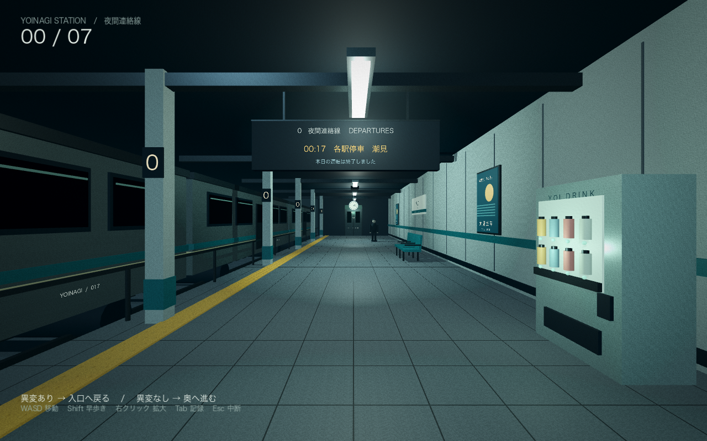

# 終電のあと — AFTER THE LAST TRAIN

『3番線』に着想を得た、Godot製の一人称3D異変探しゲームの試作です。舞台は架空の宵凪駅。出口の先にもホームが続く深夜の駅から、7回連続で正しく判断して脱出します。タイトルは仮題です。



## このMacで遊ぶ

**このフォルダの「遊ぶ.command」をダブルクリックしてください。** `build/終電のあと.app` を直接開くこともできます。アプリはGodotの編集画面を開かずに遊べます。

制作を続ける場合は、Godotで `project.godot` を開いてF5で起動します。

## ルール

1. 最初のホームには異変がありません。駅名、乗客、時計、広告、電車などを観察して奥へ進みます。この練習は連続正解に数えません。
2. 次からは、異変があれば入口の扉へ戻り、異変がなければ奥の扉へ進みます。
3. 扉に近づいて正面を向き、**E**で判断を確定します。
4. 7回連続で正解すると脱出。間違えると連続正解が0に戻り、見逃した異変の説明が出ます。

初回の練習後は必ず異変が登場します。以降、4回ごとに正常なホームを挟みます。異変の種類は抽選され、12種類を使い切るまで同じ種類を再抽選しません。間違えても攻略できるまで何度でも再挑戦できます。

## 操作

| 操作 | キー |
| --- | --- |
| 移動 | W / A / S / D |
| 見回す | マウス・トラックパッド |
| 早歩き | Shift |
| 拡大 | 右クリックを押す |
| 扉の選択を確定 | E |
| 見抜いた異変の記録帳 | Tab |
| 中断・設定 | Esc |
| 全画面切り替え | F11（必要ならFnも押す） |
| キーボードだけで移動・旋回 | ↑ ↓ で前後移動、← → で旋回 |

視点の揺れはありません。別のアプリへ切り替えると自動で中断します。

## 試作に入っているもの

- 約38mの3Dホーム、停車中の3両の電車、案内板、駅名標、時計、自動販売機、ベンチ、乗客、オリジナルの広告。
- 12種類の異変、正常なホーム、正誤判定、連続正解、脱出画面。
- 足音、駅の環境音、正解・不正解のチャイム。
- タイトル、途中再開、設定、異変の記録帳。記録帳は新しく始めても引き継ぎます。
- 判断確定時と中断時の自動保存。再開時は保存した異変を維持してホーム入口から始まります。

保存先は `~/Library/Application Support/Godot/app_userdata/終電のあと/after_last_train.json`。直前の保存は `.bak` に残ります。新しく始めると進行を最初からにし、発見済み異変の記録は残します。

## 開発・検証

このMacではGodot 4.7.1で編集・実行し、インストール済みの4.7.2 macOSテンプレートでアプリを書き出しています。描画はCompatibility / OpenGL、4x MSAA。Apple M2で起動と表示を確認しています。Intel Mac・Windows・スマートフォンは未検証です。

```sh
GODOT_BIN="/path/to/Godot.app/Contents/MacOS/Godot" ./build-macos.command
```

必要に応じて `GODOT_MACOS_TEMPLATE` にテンプレートZIPの絶対パスを指定できます。テンプレートと完成アプリは `build/` 内に保存され、Gitには含めません。コードと素材から再生成できます。

```sh
"$GODOT_BIN" --headless --path . -- --self-test
"$GODOT_BIN" --path . -- --capture=res://screenshots/platform.png --shot=platform
```

自動検証は、正常・全異変の正誤、練習、失敗時のリセット、7連続正解、抽選の重複回避、セーブ往復と破損データ、全13種のホーム構築、床の衝突、扉の距離・向き、中断・設定・記録・脱出画面を確認します。検証と画像撮影では通常のセーブを書き換えません。

ゲーム内モデル・広告・音・シェーダーはこの企画用に作成しました。『3番線』の公式続編ではなく、自主制作の新作として進めるための土台です。エンジン等の表記は `THIRD_PARTY.txt` を参照してください。
