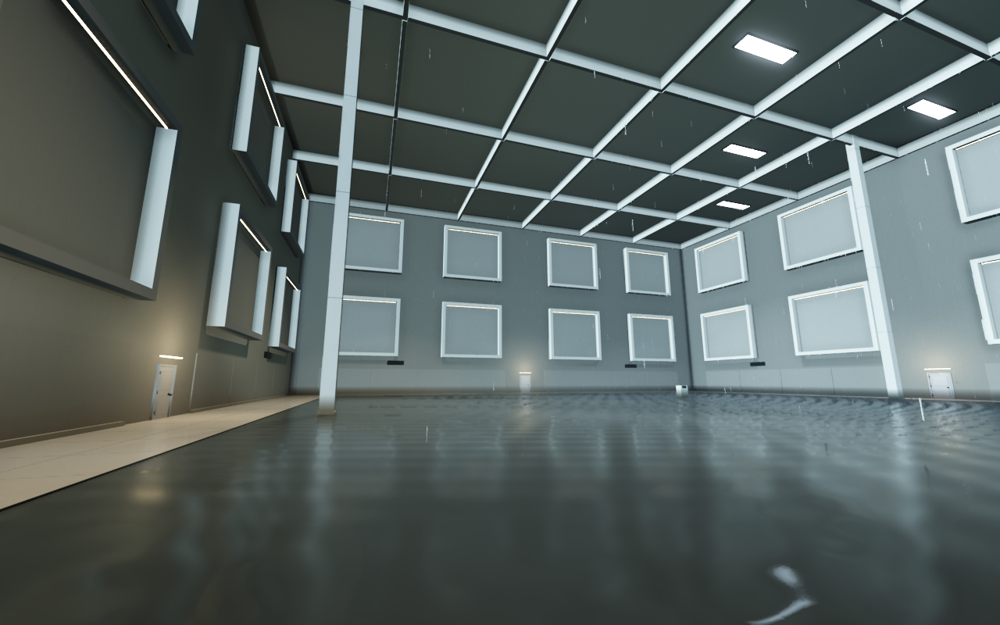

# WHITE ROOM — 白の境界

巨大な白い部屋を歩き、観測記録から規則を見つけ、隠された扉を開く一人称脱出ゲーム。**v1.1：写実的な素材・間接光・9 種類の建築空間・16 種類の怪奇現象を追加した更新版**です。



## この Mac で遊ぶ

**このフォルダの「遊ぶ.command」をダブルクリック。** または `build/WHITE ROOM.app` を開き、「はじめから」を選びます。書き出し済みアプリは Godot のインストールなしで動きます。

| 操作 | キー |
| --- | --- |
| 歩く | W / A / S / D |
| 見回す | マウス・トラックパッド |
| 早歩き | Shift を押しながら移動 |
| ドアノブを回す・調べる・取る | 近づいて中央の点を合わせ、E |
| 記録を読む | Tab または J |
| 段階式ヒント | H |
| 中断・設定・終了 | Esc |
| 全画面切り替え | F11（Mac の設定によって Fn も押す） |
| キーボードだけで移動・旋回 | ↑ ↓ で移動、← → で旋回 |

ドアの近くで E を押し、そのまま前へ歩くと通過できます。ドアは開け始めから **1 秒以内に閉じます**。再び開けられ、閉まる扉に挟まれることはありません。最初は部屋の反対側にある暗号盤の横の記録を調べてみてください。

## 入っているもの

- 1 区画約 60 × 60 m、天井高 26〜44 m。四方向に分岐し、巡り戻る 9 区画。
- 境界ホール、列柱、保全区画、水鏡、浮遊保管庫、白い記念碑、高天井、格子回廊、扉の保管庫という 9 つの構成。
- AI 画像生成による床・壁の表面素材、凹凸・粗さ・目地、影を落とす局所照明、SDFGI の間接光、反射、薄い空気の霞。
- 16 種類の現象：消灯の波、下がる天井、浮遊、届かない扉、主のいない影、呼吸する壁、色温度の変化、室内の雨、逆回転する時計、入れ子の額縁、赤い裂け目、遅れた足音、見ていない間の回転、追従する光、宙の階段、増殖する扉。
- 現象の順番は新規ゲームごとに変わり、1 巡するまで同じ種類を繰り返しません。通常の扉を実際に通過したときだけ次へ進みます。初回は消灯の波から始まります。
- 白く塗った木製ドア、丸い金属ノブ、木のモールディング。
- 観測値を集める暗号、保全キー、回路の順序パズル、隠し出口とエンディング。
- 自動保存、続きから、観測記録、3 段階のヒント、音量・感度・明るさ・視野角設定。
- 足音、ノブ、木の扉、換気の音、広さに合わせた残響。敵・戦闘・追跡・突然の脅かしはありません。
- 視点の揺れは初期設定で OFF。別のアプリへ移ると自動的に中断します。

映画や既存ゲームの素材は使用していません。3D 形状・シェーダー・音をこのプロジェクトで制作し、画像生成素材を 3D の表面に貼っています。[素材とプロンプトの記録](docs/MATERIALS.md)に生成方法をまとめています。

異常を見た記録は Tab →「異常観測の一覧」で読み返せます。現象が起きても鍵・手がかり・部屋の接続は変わらず、必ず脱出できます。以前のセーブもそのまま読み込めます。

動作が重い場合は Esc → 設定の **「高品質な間接光」** を OFF にしてください。明るさ・感度・視野角・音量も調整できます。

## 保存

15 秒ごと、部屋の移動時、謎解きの進行時、中断時に保存します。

保存先：`~/Library/Application Support/Godot/app_userdata/WHITE ROOM/white_room_v1.json`

直前の保存は `.bak` に残ります。「はじめから」を選ぶと旧データを日時付き `.archive-…` に退避します。自動試験と画面撮影は別の保存ファイルを使います。

## 開発・再ビルド

検証環境は macOS、Apple M2、Godot **4.7.2**、Metal / Forward+。書き出し設定は macOS 13 以降、Apple Silicon / Intel の Universal バイナリです。Intel 実機では未検証です。

Godot で `project.godot` を開けば編集できます。macOS 書き出しテンプレートを入れ、`build-macos.command` を実行するとアプリと ZIP を再生成します。Godot を別の場所に置く場合は `GODOT_BIN` を指定してください。

```sh
./build-macos.command --test
./build-macos.command
```

生成物は `build/` に入ります。Godot のキャッシュと書き出したアプリは Git の対象外です。この Mac 向けのローカル署名で、配布用の Apple 公証は行っていません。

検証内容は [docs/QA.md](docs/QA.md)、ネタバレを含む攻略は [docs/WALKTHROUGH.md](docs/WALKTHROUGH.md)。エンジンのライセンス表記は [THIRD_PARTY.md](THIRD_PARTY.md) にあります。
