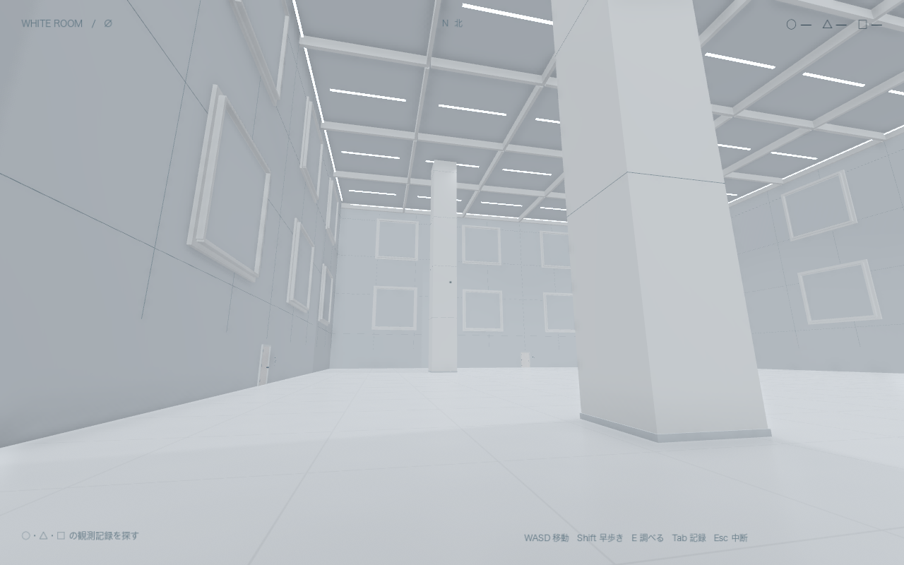

# WHITE ROOM — 白の境界

巨大な白い部屋を歩き、観測記録から規則を見つけ、隠された扉を開く一人称脱出ゲーム。Godot 製の最初のプレイ可能版です。



## この Mac で遊ぶ

**このフォルダの「遊ぶ.command」をダブルクリック。** または `build/WHITE ROOM.app` を開き、「はじめから」を選びます。書き出し済みアプリは Godot のインストールなしで動きます。

| 操作 | キー |
| --- | --- |
| 歩く | W / A / S / D |
| 見回す | マウス・トラックパッド |
| 早歩き | Shift を押しながら移動 |
| ドアノブを回す・調べる・取る | 近づいて中央の点を合わせ、E |
| 記録を読む | Tab または J |
| 段階式ヒント | H |
| 中断・設定・終了 | Esc |
| 全画面切り替え | F11（Mac の設定によって Fn も押す） |
| キーボードだけで移動・旋回 | ↑ ↓ で移動、← → で旋回 |

ドアの近くで E を押し、そのまま前へ歩くと通過できます。ドアは開け始めから **1 秒以内に閉じます**。再び開けられ、閉まる扉に挟まれることはありません。最初は部屋の反対側にある暗号盤の横の記録を調べてみてください。

## 入っているもの

- 1 区画約 60 × 60 m、天井高 26 m。四方向に分岐し、同じ景色へ巡り戻る 9 区画。
- 柱、壁の大型パネル、格子状の天井、白く塗った木製ドアと丸いノブ。
- 観測値を集める暗号、保全キー、回路の順序パズル、隠し出口とエンディング。
- 自動保存、続きから、観測記録、3 段階のヒント、音量・感度・明るさ・視野角設定。
- 足音、ノブ、木の扉、静かな機械音。敵・戦闘・追跡・突然の脅かしはありません。
- 視点の揺れは初期設定で OFF。別のアプリへ移ると自動的に中断します。

映画や既存ゲームの素材は使用していません。3D 形状・シェーダー・音をこのプロジェクトで制作しています。企画時の生成画像を参考にした実装で、画像そのものを歩ける背景にしたものではありません。大規模な完成版の AAA タイトルに相当する物量ではなく、探索から脱出までを通して遊べる最初の版です。

## 保存

15 秒ごと、部屋の移動時、謎解きの進行時、中断時に保存します。

保存先：`~/Library/Application Support/Godot/app_userdata/WHITE ROOM/white_room_v1.json`

直前の保存は `.bak` に残ります。「はじめから」を選ぶと旧データを日時付き `.archive-…` に退避します。自動試験と画面撮影は別の保存ファイルを使います。

## 開発・再ビルド

検証環境は macOS、Apple M2、Godot **4.7.2**、Metal / Forward+。書き出し設定は macOS 13 以降、Apple Silicon / Intel の Universal バイナリです。Intel 実機では未検証です。

Godot で `project.godot` を開けば編集できます。macOS 書き出しテンプレートを入れ、`build-macos.command` を実行するとアプリと ZIP を再生成します。Godot を別の場所に置く場合は `GODOT_BIN` を指定してください。

```sh
./build-macos.command --test
./build-macos.command
```

生成物は `build/` に入ります。Godot のキャッシュと書き出したアプリは Git の対象外です。この Mac 向けのローカル署名で、配布用の Apple 公証は行っていません。

検証内容は [docs/QA.md](docs/QA.md)、ネタバレを含む攻略は [docs/WALKTHROUGH.md](docs/WALKTHROUGH.md)。エンジンのライセンス表記は [THIRD_PARTY.md](THIRD_PARTY.md) にあります。
