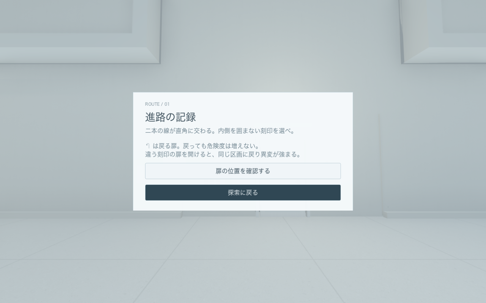

# WHITE ROOM — 白の境界

巨大な白い部屋を歩き、観測記録から規則を見つけ、隠された扉を開く一人称脱出ゲーム。**v1.4：誤った扉を開けると同じ区画へ戻り、異変が段階的に強まる版**です。



## この Mac で遊ぶ

**このフォルダの「遊ぶ.command」をダブルクリック。** または `build/WHITE ROOM.app` を開き、「はじめから」を選びます。書き出し済みアプリは Godot のインストールなしで動きます。

| 操作 | キー |
| --- | --- |
| 歩く | W / A / S / D |
| 見回す | マウス・トラックパッド |
| 早歩き | Shift を押しながら移動 |
| ドアノブを回す・調べる・取る | 近づいて中央の点を合わせ、E |
| 記録を読む | Tab または J |
| 段階式ヒント | H |
| 中断・設定・終了 | Esc |
| 全画面切り替え | F11（Mac の設定によって Fn も押す） |
| キーボードだけで移動・旋回 | ↑ ↓ で移動、← → で旋回 |

ドアの近くで E を押し、そのまま前へ歩くと通過できます。ドアは開け始めから **1 秒以内に閉じます**。再び開けられ、閉まる扉に挟まれることはありません。開ける前に扉の左側の「進路の記録」を読み、扉の上の刻印と照合してください。↶ は安全に戻る扉です。

## 入っているもの

- 1 区画約 60 × 60 m、天井高 26〜44 m。9つの区画を使う有限の11段階の順路。正しい扉は手掛かりから判断でき、誤った扉の先は同じ段階に戻ります。
- 境界ホール、列柱、保全区画、水鏡、浮遊保管庫、白い記念碑、高天井、格子回廊、扉の保管庫という 9 つの構成。
- AI 画像生成による床・壁の表面素材、凹凸・粗さ・目地、影を落とす局所照明、SDFGI の間接光、反射、薄い空気の霞。
- 40種類の空間現象から30種類、20種類の音から12種類、10系統の謎から8系統を採用。次の新規プレイでは合計20種類を交代。
- 危険度0ではランダムな空間・音の異変は休止。誤った扉を開くと発生し、正しい進路へ移動すると組み合わせが変わります。
- 白く塗った木製ドア、丸い金属ノブ、木のモールディング。
- 8台の観測器を操作して校正。6台の校正と3つの観測値、暗号、実物のキー、最終回路を経て隠し出口へ。謎の種類・観測値は新規プレイごとに変わります。
- 照明の連動、分銅、流路、時計、座標、配線など。各装置に説明・初期化・2段階のヒント。
- 扉ごとの進路の記録、●・△・□・＋の刻印、安全に戻る↶。案内図では現在の段階、正しい扉の方角、必要な作業を確認できます。
- 自動保存、続きから、観測記録、3 段階のヒント、音量・感度・明るさ・視野角設定。
- 誤った扉を開けると危険度＋1。未到達の正しい段階へ通過すると−2。5で影・崩落・圧迫による死亡。8秒後に同じ順路・刻印・謎で最初から再挑戦。
- 装置の誤答やヒント、安全な扉での引き返しでは危険度が増えません。危険度4では次の誤った扉が致命的だと明示。
- 足音、ノブ、木の扉、換気の音、広さに合わせた残響。戦闘操作はありません。
- 視点の揺れは初期設定で OFF。別のアプリへ移ると自動的に中断します。

映画や既存ゲームの素材は使用していません。3D 形状・シェーダー・音をこのプロジェクトで制作し、画像生成素材を 3D の表面に貼っています。[素材とプロンプトの記録](docs/MATERIALS.md)に生成方法をまとめています。

異常を見た記録は Tab →「異常観測の一覧」で読み返せます。道を間違えるほど同じ区画がおかしくなり、5段階目で死亡して進行を失います。[ルート・死亡・再挑戦のルール](docs/FAILURES.md)に詳細をまとめています。古いセーブは取得済みの鍵・観測値・脱出条件を保持して有限の順路へ移行します。v1.3の危険度も保持されます。

50種類はその回に登場できる種類です。すべてを見るまで脱出を待たせることはなく、最後の扉を開ける前に任意で探索を続けられます。[種類の一覧と設計](docs/RUN-VARIATIONS.md)にまとめています。

動作が重い場合は Esc → 設定の **「高品質な間接光」** を OFF にしてください。明るさ・感度・視野角・音量も調整できます。

## 保存

15秒ごと、部屋の移動時、謎解きの進行時、中断時に保存します。誤った扉の危険度は開けた時点で保存するため、閉まる前に終了しても間違いは取り消されません。

保存先：`~/Library/Application Support/Godot/app_userdata/WHITE ROOM/white_room_v1.json`

直前の保存は `.bak` に残ります。「はじめから」を選ぶと旧データを日時付き `.archive-…` に退避します。自動試験と画面撮影は別の保存ファイルを使います。

## 開発・再ビルド

検証環境は macOS、Apple M2、Godot **4.7.2**、Metal / Forward+。書き出し設定は macOS 13 以降、Apple Silicon / Intel の Universal バイナリです。Intel 実機では未検証です。

Godot で `project.godot` を開けば編集できます。macOS 書き出しテンプレートを入れ、`build-macos.command` を実行するとアプリと ZIP を再生成します。Godot を別の場所に置く場合は `GODOT_BIN` を指定してください。

```sh
./build-macos.command --test
./build-macos.command
```

生成物は `build/` に入ります。Godot のキャッシュと書き出したアプリは Git の対象外です。この Mac 向けのローカル署名で、配布用の Apple 公証は行っていません。

検証内容は [docs/QA.md](docs/QA.md)、ネタバレを含む攻略は [docs/WALKTHROUGH.md](docs/WALKTHROUGH.md)。エンジンのライセンス表記は [THIRD_PARTY.md](THIRD_PARTY.md) にあります。
